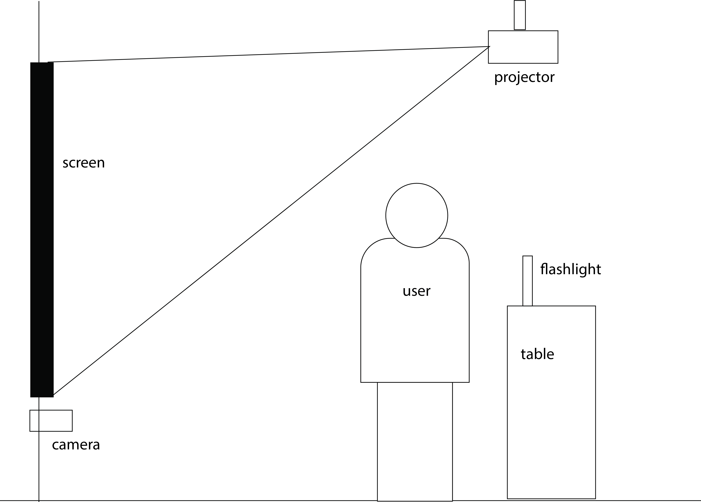

# scaredOfTheDark

This is an interactive program. It uses pixel tracking to repel points. In this case, the ghosts are the points and they are repelled by the brightest pixel. To use, point a flashlight at the camera and move it to scare the ghosts away!!
  
Here is a diagram of the ideal set up, if this became an actual installation. It would ideally have dimmed lighting and a flat background.
  

  

### Sources: 
**Music by www.bensound.com**
  
particle.cpp and particle.h adapted from ofMathParticle_Brightestpx by alexmargineanu
https://github.com/alexmargineanu/ofMathParticle_Brightestpx
